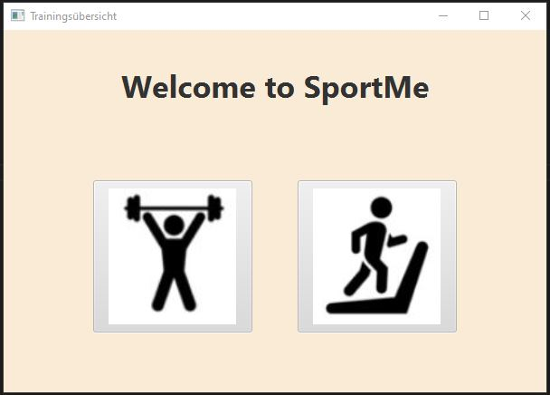
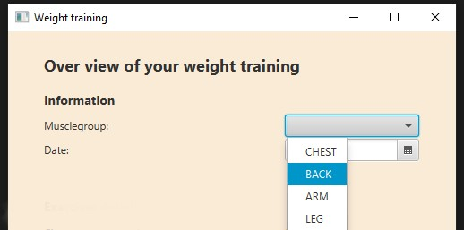
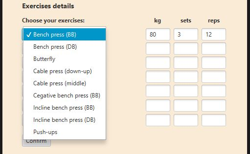
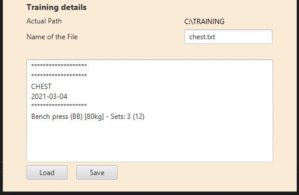

# SportMe - training app

The final project in object-oriented programming. 

In the future I will optimise this project with a database (MySQL). 

## Contents
  - [Contents](#contents)
  - [General info](#general-info)
  - [Technologies and tools](#technologies%20and%20tools)
  - [Using SportMe](#using-sportme)

## General info

This is a great opportunity to demonstrate through this project the know-how we have acquired in
class.

## Technologies and tools

This Project was created with:
* Java 13
* JavaFX 15.0.1
* Visual Studio Code
* SceneBuilder

<br />
<br />

## Using SportMe

<br />

1. Choose your training



<br />
<br />


Have a look over the main view and chosse between a weight or cardio training.

<br />
<br />


2. Training information

<br />



<br />

Please fill out the required information. It is needed to proceed with your training.

<br />
<br />


3. Choose your exercises

<br />



<br />

Make sure to not leave a field empty, or else there will occur a "error" message. All information about the weight, sets and reps are required.

Finally select the button "Confirm". All the information will transform into the "TextArea".

<br />
<br />

4. Saving the training details 

<br />



<br />
<br />

Save all the details of your training session with the button "Save". The details will be saved on a textfile.
<br />
If this textfile already exists, the content will be appended at the bottom of the textfile.


This part of the code is the reason why will be appended:

```java
BufferedWriter writer = Files.newBufferedWriter(path, 
	Charset.forName("UTF-8"),
	StandardOpenOption.CREATE,
	StandardOpenOption.APPEND);
```
<br />
<br />

5. Have fun and have a great workout!
